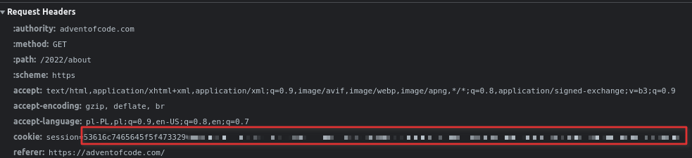
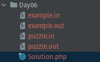
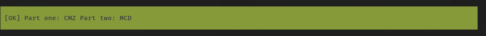
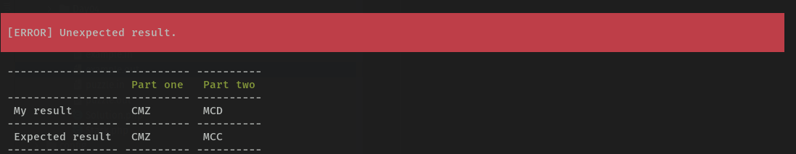

# Advent of Code

This repository contains my [Advent of Code](https://adventofcode.com/) solutions in PHP and a library built on Symfony that helps me work on puzzle-solving more conveniently.

## How to use

### Configure

Create `.env` file based on `.env.example`.

```bash
cp .env.example .env
```

#### How to get value for `SESSION_ID`? 

Login into your account on Advent of Code website, open **Network tab** in your browser and copy and find session in cookie.



### Generate solution template

It is helpful in immediately starting to solve puzzles. It creates all the required files for a puzzle. The default day is **today**.

Furthermore, this command:
- fetches puzzle name and injects it to attribute in solution class,
- fetches puzzle input and stores it in `puzzle.in`,
- fetches example input (with 99% accuracy) and stores it in `example.in`.

```bash
php app.php app:generate-template [--year=2022] [--day=1]
```



### Solve puzzle

It runs a puzzle solver for a given day and compares it with expected results.

- you can pass example number to solve not default example input. There is five examples available.

```bash
php app.php app:solve [--year=2022] [--day=1] [--puzzle] [--example=3]
```

#### Good result


#### Wrong result


### Upload answers

If you have solved the task correctly for puzzle input, you can immediately send it to AOC server. This command fetches answers from a server and sends them if they are missing. The default day is **today**.

If answers are correct, it saves them to `puzzle.out` file in dir with a solution.

```bash
php app.php app:upload [--year=2022] [--day=1]
```

### List all puzzles and check the results
It displays a table with all puzzles for a given year. The default year is the current year.

- Click on puzzle name, opens browser with the puzzle description,
- in the table, you can notice execution time for exemplary and individual puzzle input.

```bash
php app.php app:list [--year=2022]
```


### Fetch puzzle inputs and outputs

It fetches all puzzle inputs and outputs for existing solvers for given year.

```bash
php app.php app:fetch-puzzle-input-and-output [year]
```

