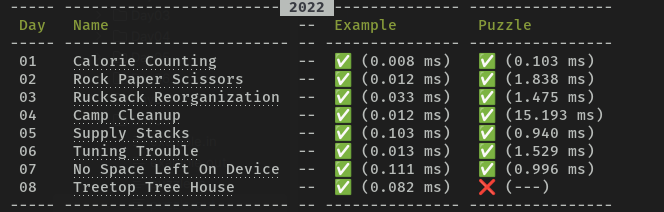

# Advent of Code

This repository contains my [Advent of Code](https://adventofcode.com/) solutions in PHP.

## How to use
### Generate solution template

It is useful to immediately start solving puzzle. It creates all required files for today's puzzle.

```bash
php app.php app:generate-template
```

### Solve puzzle

```bash
php app.php app:solve [--year=2022] [--day=1] [--puzzle]
```

### List all puzzles and check results
```bash
php app.php app:list
```


